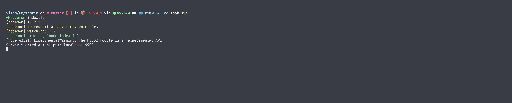
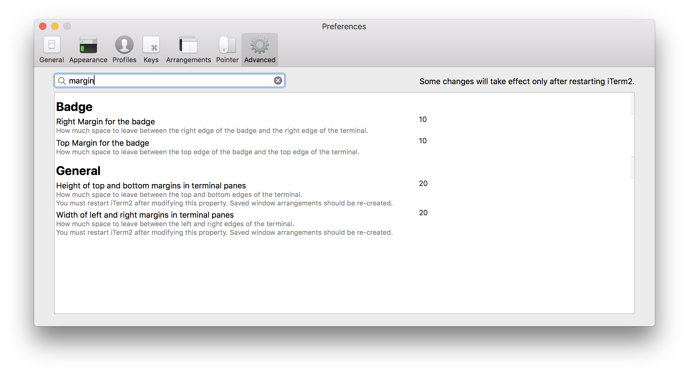
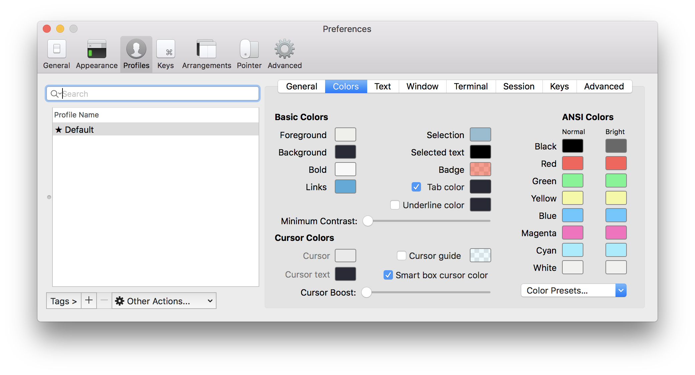

# Dev setup
My working woking station

* Add welcome message, modify this file: `/etc/motd`
* [Iterm2](https://www.iterm2.com/downloads.html)
* Iterm2 Theme [Snazzy](https://github.com/sindresorhus/iterm2-snazzy)
* Iterm2 Font [FiraCode](https://github.com/tonsky/FiraCode)
* [Installing ZSH · robbyrussell/oh-my-zsh Wiki · GitHub](https://github.com/robbyrussell/oh-my-zsh/wiki/Installing-ZSH)
* Add [zsh syntax highlighting](https://github.com/zsh-users/zsh-syntax-highlighting)
* Add [Fish-like autosuggestions for zsh](https://github.com/zsh-users/zsh-autosuggestions)
* `npm install -g spaceship-zsh-theme` [spaceship-zsh-theme  -  npm](https://www.npmjs.com/package/spaceship-zsh-theme)
* Iterm set height and width margins to 20

[image:134197DE-2E5D-4A07-83C0-A8EE514AB939-32046-00004BEF9E40838F/Screen Shot 2018-09-06 at 11.28.31 PM.png]
* Colors in iterm2:

Bonus:
brew install shpotify
